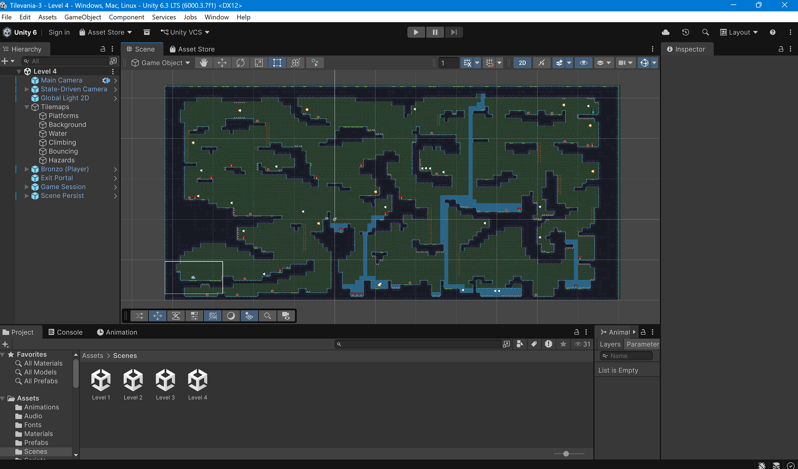

# Lab 02 - Khám phá dự án tilevania-3

## Thông tin sinh viên
- **Họ tên**: Nguyễn Thị Trường Nga
- **MSSV**: 2312697
- **Lớp**: CTK47A

## Mô tả
Bài thực hành Lab 02môn **Game 2D Development with Unity**.  
Khám phá và phân tích dự án game tilevania-3 

## Các thay đổi đã thực hiện
- Tiến hành mở rộng dự án, phát triển một màn chơi mới (level4)

## Screenshots## Screenshots

## Kiến thức đã học được
1. Hiểu cấu trúc dự án Unity (Assets, Prefabs, Scripts, Scenes,...)
2. Sử dụng Tilemap để xây dựng map 2D
3. Áp dụng Cinemachine để điều khiển camera
4. Quản lý game state với GameSession (Singleton + DontDestroyOnLoad)
5. Xử lý input và chuyển động nhân vật với PlayerMovement
6.Làm quen với Git/GitHub: clone project, commit và push mã nguồn lên repository.
